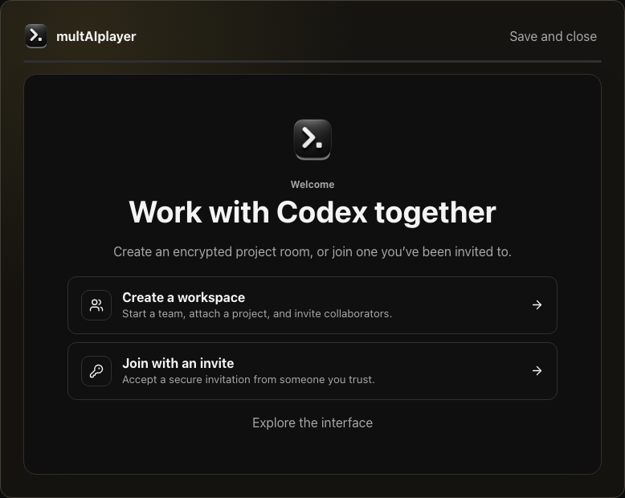
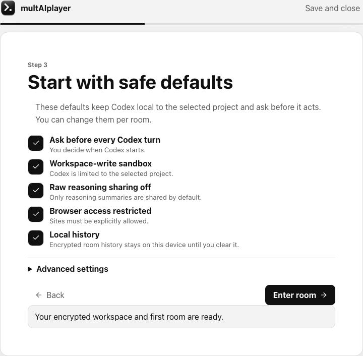
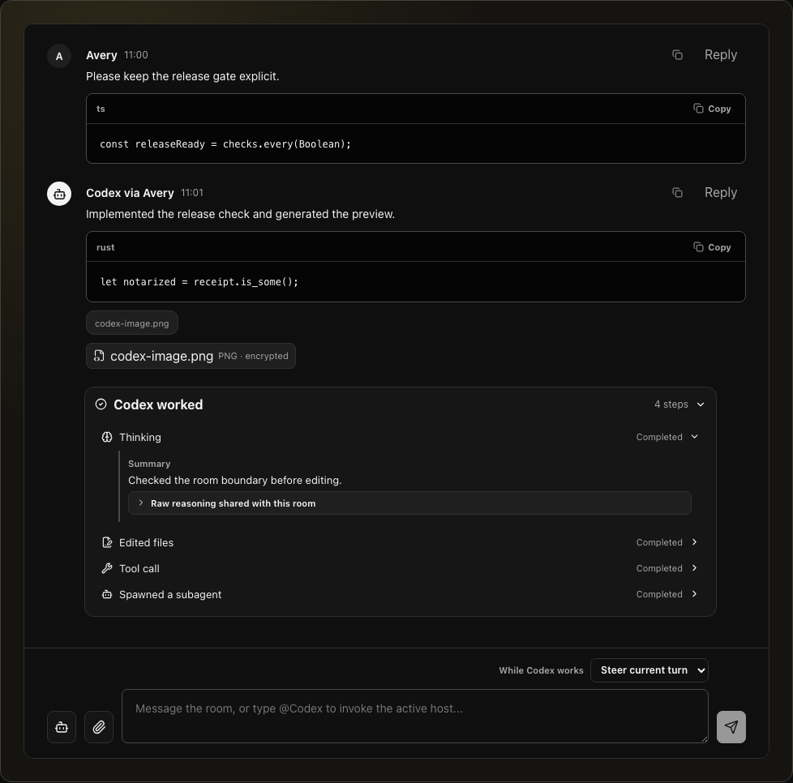

<p align="center">
  
</p>

<h1 align="center">multAIplayer</h1>

<p align="center"><strong>Build with Codex. Together.</strong></p>

<p align="center">
  Multiplayer Codex for trusted teams: talk through the work, steer one shared Codex session,<br>
  review what it changes, and move the active host between teammates.
</p>

<p align="center">
  <a href="https://multaiplayer.com">Website</a> ·
  <a href="docs/using-the-app.md">Using the app</a> ·
  <a href="docs/faq.md">FAQ</a> ·
  <a href="docs/threat-model.md">Security model</a> ·
  <a href="CONTRIBUTING.md">Contributing</a>
</p>

> [!IMPORTANT]
> multAIplayer is a free, open-source alpha for Apple silicon Macs running macOS 11 or later. No supported public build has been published yet. The website will enable its download only after a Developer ID-signed and notarized release passes the release gates.

## Multiplayer Codex, built around your project

Start a private room around a local project, invite the people you trust, and work with Codex as a team. Everyone can follow the conversation, propose the next turn, see structured progress, review changes, and keep the work moving. One active host at a time provides the project, local tools, credentials, and Codex account; hosting can be handed to another verified member when the work moves to their machine.

## Start together, stay in control

<p align="center">
  
  
</p>

## Work with Codex in the room

<p align="center">
  
</p>

## One room for the whole build loop

multAIplayer puts the collaboration surfaces around Codex beside the conversation, so a team can inspect, run, preview, and ship the work without losing the shared thread.

- **A real code editor.** Browse the active host's project and edit text files in an embedded [Monaco Editor](https://microsoft.github.io/monaco-editor/) surface with language-aware editing. Open bounded file previews and diffs, attach a file to chat, or expand the editor for focused work. The host can save directly; a teammate's save becomes an explicit host approval request.
- **A real terminal.** Named, room-scoped terminals use [xterm.js](https://xtermjs.org/) over a native Rust PTY. The host can create, restart, stop, and interact with terminals while the room keeps a reviewable workflow around command requests. Native confirmation shows the exact room, project, command, or input before execution.
- **An isolated project browser.** Open localhost, documentation, or an approved site in room/project-scoped native WebView tabs instead of the host's everyday browser profile. Hosts control profile persistence and can reset it; downloads, page clipboard access, file inputs, and drag/drop uploads are blocked where the platform permits.
- **Share a localhost build.** The host can expose an explicit `localhost` or `127.0.0.1` port with a temporary Cloudflare Quick Tunnel and open the resulting preview in the room browser. Preview sharing requires [`cloudflared`](docs/local-preview-sharing.md) on the host Mac (`brew install cloudflare/cloudflare/cloudflared`); multAIplayer does not proxy the site through its relay. Quick Tunnel URLs are public while running, so review the build before sharing it.
- **Codex work you can follow.** See bounded, structured activity for commands, file changes, tools, web work, images, and subagents. Steer an active turn, queue the next proposal, set a thread goal, or inspect and fork the Codex thread graph.
- **Git and GitHub in context.** Review the current working tree, copy project and diff summaries, create a branch, commit, push, open a draft pull request, and follow GitHub Actions from the room. The **Changed files** list is the current Git working-tree status—not a list of everything merged since the last PR; [the user guide explains the exact comparison](docs/using-the-app.md#project-files-and-diffs).
- **Encrypted room portability.** Export a room's display history to a passphrase-encrypted, interoperable age archive, then import it later as a read-only library—even while signed out or disconnected. Archives deliberately omit MLS keys, device credentials, pending approvals, host authority, and other live capabilities; see [Encrypted room archives](docs/room-archives.md).
- **Private team continuity.** Chat, attachments, approvals, activity, and host handoff travel as MLS-encrypted room events. One active host supplies the current checkout, tools, credentials, and Codex account, and can hand that role to another verified member.

## How a room works

Each room connects your team to one active host's project and Codex session:

1. Create a workspace, attach a project, and invite trusted teammates—or join a room you were invited to.
2. Discuss the work in the room and propose Codex turns together.
3. The active host reviews what the turn will share and what access it requests before Codex starts.
4. Codex works locally on the host's machine while the room shows progress, approvals, edits, Git activity, and results.
5. Hand hosting to another verified member when the team needs their project checkout, tools, or credentials.

Alongside chat and Codex, the room brings together project files and diffs, terminals, Git and GitHub workflows, encrypted attachments, Codex thread forks, and subagent activity. See [Using the app](docs/using-the-app.md) for a tour.

## What sharing a room means

A room is for people you trust to collaborate on the active host's project. Members can see the context the host shares and can request actions involving the project, terminal, Git, GitHub, and Codex session. The active host stays responsible for reviewing approvals and choosing the access Codex receives.

- Chat, shared Codex activity, and attachments travel through RFC 9420 MLS encryption owned by the native Rust boundary.
- The relay coordinates rooms and membership. It is designed not to receive plaintext chat, attachment contents, project files, host-local project paths, Codex model configuration, terminal output, or Codex/OpenAI credentials.
- GitHub sign-in requests `read:user repo` so repository workflows can work with both public and private repositories the user can access. The native app keeps the token in macOS Keychain and calls GitHub directly for pull requests and Actions; the relay observes it only during sign-in identity verification and immediately discards it. Local Git uses the host's existing credentials.
- Invite links contain a private, single-use bearer capability in the URL fragment. Share the complete link only through a private channel; never paste it into an issue, log, diagnostic, or support request.
- This is alpha software. Its encryption and host-authority boundaries have extensive automated test coverage, but they have not received an independent professional security audit.

Read the [threat model](docs/threat-model.md), [cryptography architecture](docs/cryptography.md), [alpha limitations](docs/alpha-limitations.md), and [security policy](SECURITY.md) before using private projects.

## The free alpha

The official relay is live on Railway at `https://relay.multaiplayer.com` and `wss://relay.multaiplayer.com/rooms`. GitHub Device Flow identifies members, so there is no separate multAIplayer password, subscription, or billing account.

The service is free, experimental, and has no uptime, recovery, or response-time guarantee. Keep normal Git and project backups. The Profile drawer can delete hosted account data after owned teams are transferred or deleted and hosted rooms are handed off; shared encrypted records, other members' copies, local room state, GitHub's OAuth grant, and backup rotation are separate deletion boundaries.

The alpha relay is deliberately a single Node process with one SQLite writer and process-local WebSocket fan-out, deployed behind a trusted TLS reverse proxy/WAF. It enforces durable account quotas and operator-managed account restrictions, but does not claim horizontal failover. Larger installations should shard complete teams across independent relays rather than point multiple processes at one store; the rationale is recorded in the [single-node relay ADR](docs/decisions/single-node-relay.md).

Hosted use is governed by the [Privacy Policy](https://multaiplayer.com/privacy) and [Terms of Service](https://multaiplayer.com/terms). The [self-hosting guide](docs/self-hosting.md) covers independent relay deployments, and [If this project goes unmaintained](docs/if-unmaintained.md) explains the continuity plan.

## Build the app locally

Prerequisites are Node.js 22, npm, Rust/Cargo, Xcode command-line tools, and Codex. On macOS:

```sh
npm ci
cp .env.example .env
npm run doctor
npm run tauri:dev
```

GitHub sign-in uses the public OAuth client id embedded in the native build; no client secret is required or supported. Self-built native clients can override the client id and pinned relay origin at compile time as documented in [Self-hosting](docs/self-hosting.md). The root development command starts the local relay and the frontend used by Tauri. multAIplayer is a native app; opening the development URL in a normal browser shows only an install notice.

Useful verification commands:

```sh
npm run check
npm test
npm run verify
```

`npm run verify` runs the TypeScript, UI, relay, package, Rust, and native verification layers. More expensive mutation, fuzzing, supply-chain, and reproducibility jobs run on their documented CI schedules. See [the CI policy](docs/ci-policy.md) for exact evidence boundaries.

## Repository map

| Path                                     | Responsibility                                                                     |
| ---------------------------------------- | ---------------------------------------------------------------------------------- |
| `apps/desktop`                           | React desktop UI and the Tauri/Rust native boundary                                |
| `apps/desktop/src-tauri/crates/mls-core` | MLS lifecycle, HPKE invites, encrypted state, and history/blob exporters           |
| `apps/relay`                             | Authenticated HTTP/WebSocket relay, identity verification, persistence, and quotas |
| `packages/protocol`                      | Shared wire records and runtime validation                                         |
| `packages/codex`                         | Codex app-server client and compatibility contract                                 |
| `packages/git`, `packages/github`        | Host-side Git and GitHub adapters                                                  |
| `e2e`                                    | UI contracts and real multi-process native journeys                                |
| `docs`                                   | User guides, architecture, operations, decisions, and review material              |

The supported Codex app-server range is 0.133.0–0.144.0. Newer versions are marked unverified, and contract-sensitive behavior fails closed until reviewed. Read [How Codex hosting works](docs/codex-hosting.md) for the exact local-account, approval, projection, and compatibility boundaries.

## Contributing and review

Contributions are welcome. Start with [CONTRIBUTING.md](CONTRIBUTING.md), the [architecture walkthrough](docs/architecture-walkthrough.md), and the small issues in [`.github/good-first-issues`](.github/good-first-issues). Commits require a Developer Certificate of Origin sign-off.

Protocol and cryptography reviewers can use the [external review packet](docs/external-review-packet.md), which maps the security claims to implementation and test evidence. Report exploitable findings privately through the process in [SECURITY.md](SECURITY.md).

## Release integrity

Supported public artifacts are Apple-silicon-only, Developer ID signed, notarized, and published by the tagged release workflow. The workflow verifies the macOS 11 deployment target, bundled Mach-O architectures, live universal-link associations, entitlements, code signatures, stapled tickets, Gatekeeper acceptance, checksums, SBOM, provenance, and Sigstore signatures before publication. Local and ordinary CI packages are development evidence, not supported downloads.

Apache-2.0 licensed. Third-party notices are in [THIRD_PARTY_NOTICES.md](THIRD_PARTY_NOTICES.md).
