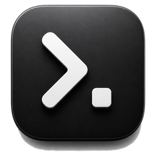
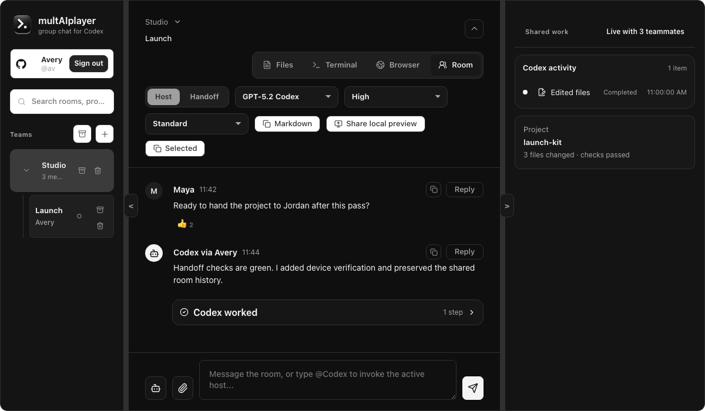
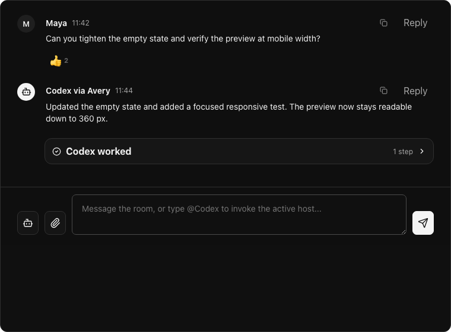
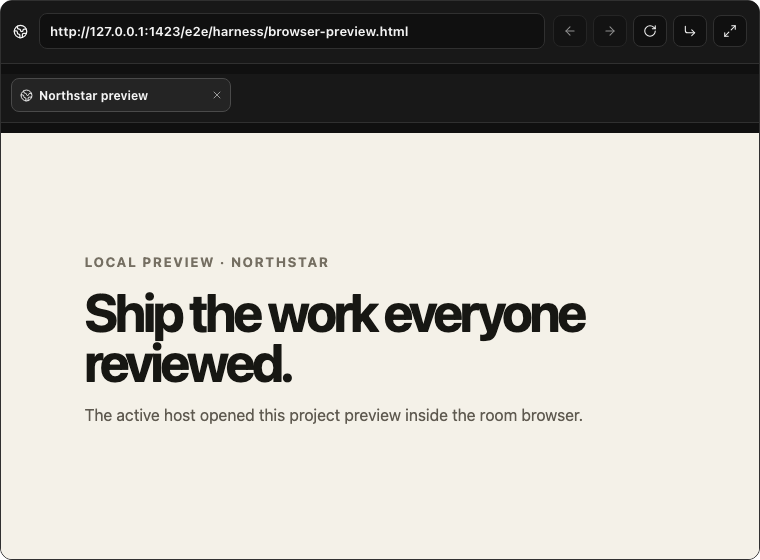
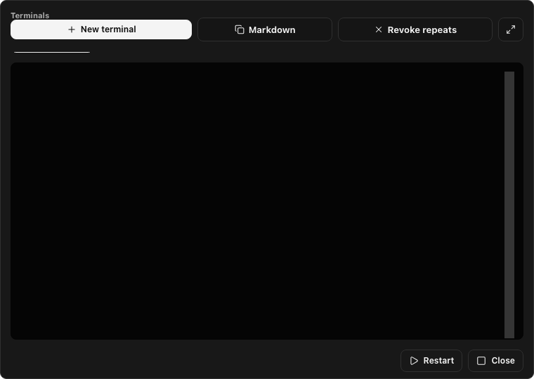

<p align="center">
  
</p>

<h1 align="center">multAIplayer</h1>

<p align="center"><strong>Build with Codex. Together.</strong></p>

<p align="center">
  Multiplayer Codex for trusted teams: discuss the work, steer one shared local Codex session,<br>
  review what it changes, and hand hosting between teammates.
</p>

<p align="center">
  <a href="https://multaiplayer.com">Website</a> ·
  <a href="docs/using-the-app.md">User guide</a> ·
  <a href="docs/faq.md">FAQ</a> ·
  <a href="docs/threat-model.md">Threat model</a> ·
  <a href="CONTRIBUTING.md">Contributing</a>
</p>

> [!IMPORTANT]
> multAIplayer is a free, open-source alpha for Apple-silicon Macs running macOS 11 or later. No supported public build has been published yet.

## The product

Start a private project room, invite people you trust, and work with Codex as a team. Everyone can follow the conversation, propose the next turn, inspect structured progress, review changes, and use room-scoped files, diffs, terminals, browser previews, Git, and GitHub workflows. One active host supplies the project, local tools, credentials, and Codex account; an explicit handoff can move that responsibility to another verified member.

<p align="center">
  
</p>

<p align="center">
  
</p>
<p align="center">
  
</p>
<p align="center">
  
</p>

multAIplayer does not provide or replace Codex's system or developer instructions. It connects to the standard open-source Codex app-server running on the active host. An approved room turn becomes ordinary user-turn input: the app formats the selected conversation and attachments, and explicitly labels teammate, file, terminal, browser, and tool material as untrusted context.

## Independent project

multAIplayer is an independent open-source project. It is **not** an official OpenAI or Codex product and is not affiliated with, endorsed by, or sponsored by OpenAI. OpenAI and Codex are trademarks of OpenAI.

## Security posture

Rooms use RFC 9420 MLS through the Rust `mls-rs` implementation, and relevant payloads use exporter-derived encryption in the native boundary. The relay routes encrypted records but necessarily observes bounded identity, routing, size, timing, and lifecycle metadata. The active host remains responsible for local approvals, and admitted members receive meaningful shared context. Complete invite links are capabilities and must remain private. The integration is **unaudited**; behavior tests, property checks, fuzzing, native journeys, and release verification reduce regression risk but do not replace independent review. The [threat model](docs/threat-model.md) is the only normative source for intended properties, assumptions, evidence, and residual risks.

Before private use, read the [alpha limitations](docs/alpha-limitations.md), [cryptography mechanism guide](docs/cryptography.md), and authoritative [threat model](docs/threat-model.md). Report vulnerabilities through [SECURITY.md](SECURITY.md).

## Build locally

Prerequisites are Node.js 22, npm 11.16.0, Rust/Cargo, Xcode command-line tools, and Codex:

```sh
npm install --global npm@11.16.0 --ignore-scripts
npm ci
cp .env.example .env
npm run doctor
npm run tauri:dev
```

The root command starts the local relay and Tauri frontend. GitHub sign-in uses a public OAuth client id; no client secret is supported. Custom relay origins require a self-built client as described in [Self-hosting](docs/self-hosting.md).

Run the verification ladder before publishing changes:

```sh
npm run check
npm test
npm run verify
```

Pull requests run workspace checks and product journeys when executable code changes. Scheduled workflows provide focused fuzz, supply-chain, container, and Codex-compatibility checks. Releases verify signing, notarization, authenticated updater metadata, the exact release asset set, and checksums. [CONTRIBUTING.md](CONTRIBUTING.md) owns the exact workflow policy.

## Repository map

| Path                                                | Responsibility                                          |
| --------------------------------------------------- | ------------------------------------------------------- |
| `apps/desktop`                                      | React/Tauri desktop and native capability boundary      |
| `apps/desktop/src-tauri/crates/mls-core`            | MLS, invite cryptography, exporters, encrypted state    |
| `apps/relay`                                        | Authenticated transport, SQLite persistence, and quotas |
| `packages/protocol`                                 | Shared wire records and runtime validation              |
| `packages/git`, `packages/github`                   | Host-side integrations                                  |
| `e2e`                                               | UI contracts and multi-process journeys                 |
| `docs/decisions`                                    | Normative architecture decisions                        |

The [architecture guide](docs/product-architecture.md) maps flows to code. SQLite is the relay's sole runtime backend, but the alpha relay keeps its durable working set in memory and stores entity payloads as JSON rows rather than exposing a general relational query model. Mutations are synchronously committed before a successful response or broadcast, and the in-memory durable-entry count has an explicit ceiling. A runtime SQLite write failure makes the relay not ready and stops further product traffic until restart rather than serving memory that may differ from disk. See the [single-node relay ADR](docs/decisions/single-node-relay.md).

## Releases and operations

Supported macOS releases are Developer ID-signed, notarized, published with checksums, and use authenticated updater metadata bound to the exact signed bundle. Verification instructions live in [Verifying releases](docs/reproducible-builds.md).

The pre-committed updater public key has minisign key id `5F97AE260BE16B2F`. The SHA-256 fingerprint of the exact committed `apps/desktop/src-tauri/updater-public.key` file is `626f3a15f71fc8c5794c9ce00392a12f782cd05ec47a88ce27858b43ce774673`. Compare that hash with the independently published fingerprint on [multaiplayer.com](https://multaiplayer.com/security/updater-key) before trusting a first install or a compromise-recovery key.

The official alpha relay is a deliberately single-node Node/SQLite service with no uptime or recovery guarantee. Keep ordinary Git/project backups. Operators should follow [Self-hosting](docs/self-hosting.md) and the [single-node relay ADR](docs/decisions/single-node-relay.md).

Contributions are welcome; start with [CONTRIBUTING.md](CONTRIBUTING.md). Apache-2.0 licensed. Third-party notices are in [THIRD_PARTY_NOTICES.md](THIRD_PARTY_NOTICES.md).
