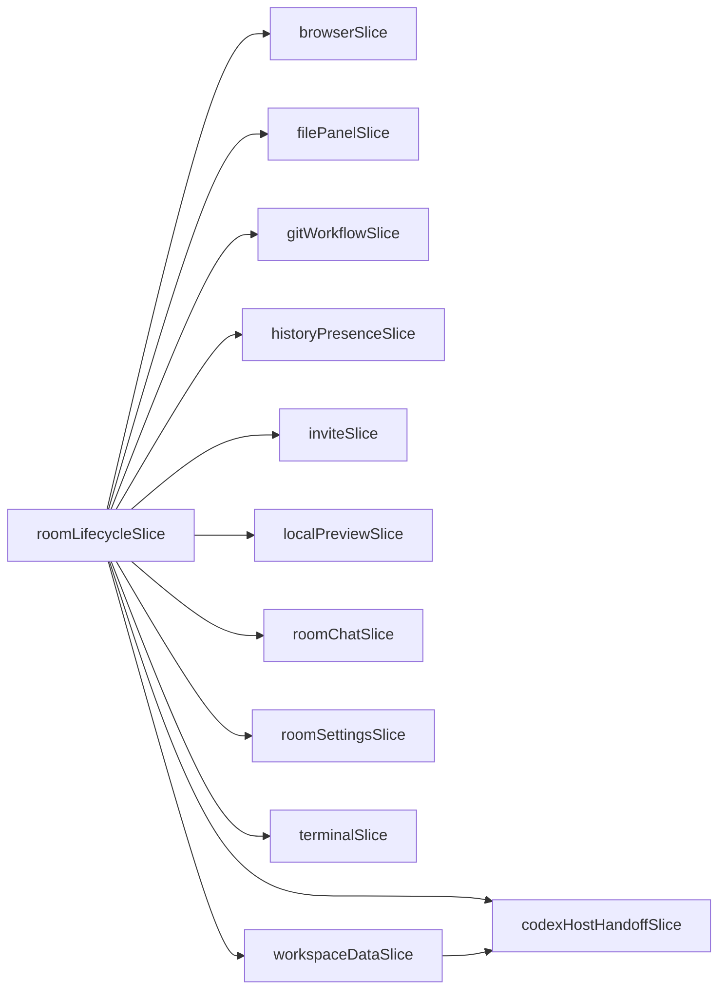

# Zustand store boundaries

Status: accepted

Date: 2026-07-10

## Context

The desktop app combines long-lived workspace data, per-room encrypted state, host-local runtime state, and transient shell UI. Those domains are read from React components, relay event routing, imperative action factories, and tests that do not mount React. Passing one app-wide view model through the component tree made ownership unclear and caused callback identities and unrelated renders to move together.

## Decision

Use one typed Zustand store composed from domain slices. A slice owns the canonical state and mutations for one durable concern, such as room chat, browser state, terminals, invites, workspace records, or Codex runtime. `appStore.ts` composes those slices and owns the coherent reset path; it is not a second domain layer.

Components subscribe to the narrowest value they render, preferably a room-scoped entry selected by room id. Multi-field component subscriptions use shallow comparison when the selected object is recreated. Derived display data belongs beside its domain or in a focused selector/helper, not in a parallel view-model store.

React hooks own subscriptions, effects, refs, and component-tree composition. Imperative action factories belong under
`application/` and read current actions through `useAppStore.getState()` at invocation time. Slices contain synchronous
state transitions only; ESLint rejects async functions and `await` inside `store/slices/`. This keeps relay routing and
commands independent of render-time closures and makes them directly testable without a renderer.

Effectful capabilities that cannot safely live in serializable store state—native backends, relay connections, and current refs—are passed explicitly at composition boundaries.

## Enforced dependency graph

Each slice owns its state fields. ESLint rejects a slice that accesses another slice's fields unless the edge is listed in the architecture rule. The two intentional coordinators are shown below; all unshown slices have no cross-slice state dependency.

`roomLifecycleSlice` is the atomic hydrate/clear coordinator for room-scoped state. `workspaceDataSlice` updates Codex pending and queued approvals atomically when their source chat messages are edited or deleted. New edges require an ADR update, an explicit ESLint allowlist entry, and focused atomicity tests.

## Consequences

- Room-scoped state must not leak through a global “selected room” cache.
- Slice reset state and the app-wide reset must evolve together.
- New compatibility wrappers, selector bundles, callback proxies, and duplicate view-model layers require a concrete need; convenience alone is insufficient.
- Cross-slice mutations are allowed only when the owning action preserves the affected domains atomically and has focused tests.
- Direct `getState()` access is appropriate for imperative actions, but React rendering should use subscriptions so updates remain visible and bounded.

## Revisit when

Reconsider this shape if independently deployed desktop modules need isolated stores, if measured selector cost becomes material, or if a different state system can preserve room scoping, imperative access, atomic reset, and renderer-free testing with less coupling.
